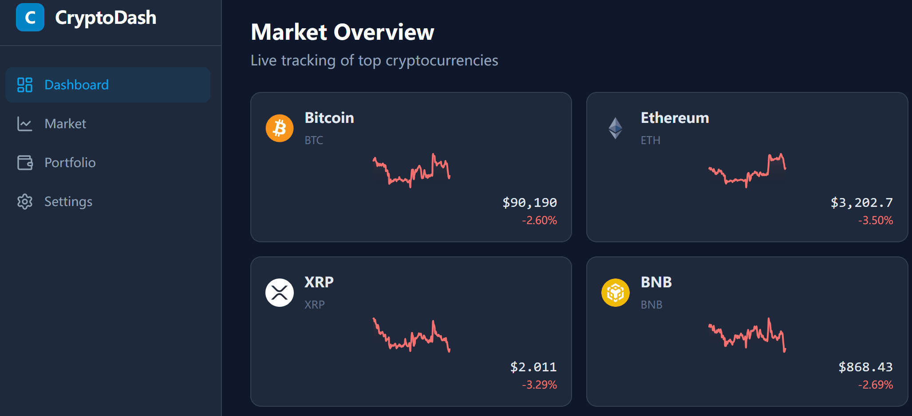
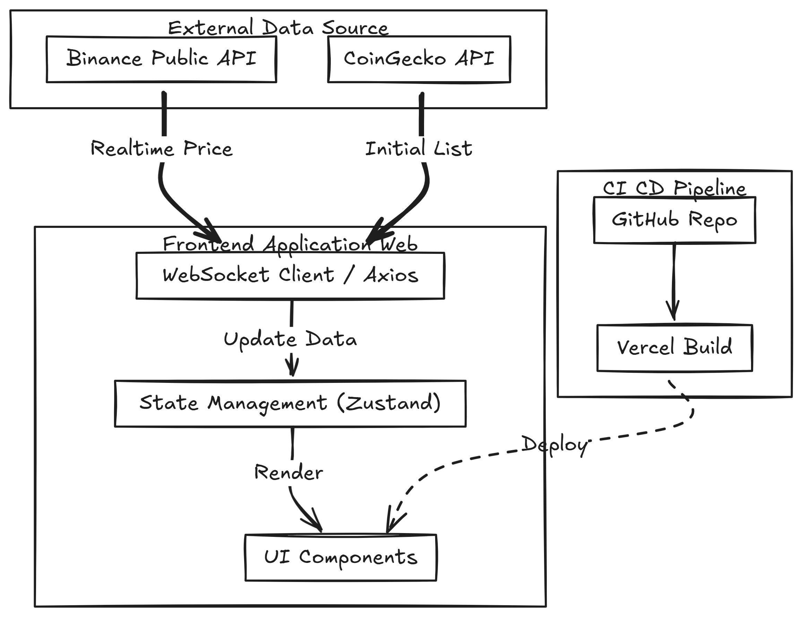

# 📈 Crypto Dashboard

[](https://github.com/xtxd-yym/crypto-dashboard-pro/actions/workflows/ci.yml)

A high-performance, real-time cryptocurrency dashboard built to monitor market trends and manage asset portfolios. Designed with a focus on **performance**, **clean architecture**, and **testability**.


## ✨ Key Features

* **Real-time Market Data**: Live cryptocurrency pricing updates with polling mechanisms.
* **Interactive Visualization**: High-performance charts using Apache ECharts.
* **Portfolio Management**: Track asset value with real-time calculations.
* **Optimized UX**: "Silent Updates" ensure data refreshes without blocking UI interactions.
* **Robust Error Handling**: Graceful degradation and user-friendly error messages.

## 🛠 Tech Stack

* **Core**: React 19, TypeScript, Vite
* **State Management**: Zustand (chosen for atomic updates and minimal boilerplate)
* **Styling**: TailwindCSS
* **Data Fetching**: Axios (with AbortController for cancellation)
* **Testing**: Vitest, React Testing Library
* **Visualization**: ECharts for React

## ✨ Feature Demo
> **Real-time Updates:** Data is pushed instantly via WebSocket (Binance API).

<div align="center">
  
</div>

## 🏗️ Architecture
<div align="center">
  
</div>

## 🧠 Technical Highlights & Decisions

### 1. State Management Strategy
Instead of a monolithic Redux store, I opted for **Zustand**. This allows for:
* **Atomic Selectors**: Components only re-render when the specific slice of state they consume changes.
* **Decoupled Logic**: Business logic (fetching, transforming data) is encapsulated within the store actions, keeping UI components pure.

### 2. Performance Optimization
* **Silent Polling**: The `useMarketStore` implements a polling mechanism that distinguishes between "Initial Load" (spinner) and "Background Update" (silent), preventing UI flicker.
* **Throttled Rendering**: Chart components use `useMemo` to ensure expensive canvas repaints only occur when data actually changes.

### 3. Testing Strategy
* **Unit Tests**: Focused on complex business logic within Stores (e.g., snake_case transformation, polling limits).
* **Integration Tests**: Verify that hooks interacts correctly with the API layer.
* **Mocking**: Used `vi.useFakeTimers()` to test time-dependent features like polling without slowing down the test suite.

## 🚀 Getting Started

### Prerequisites
* Node.js >= 18
* pnpm (recommended) or npm/yarn

### Installation

```bash
# Clone the repository
git clone [https://github.com/your-username/crypto-dashboard.git](https://github.com/your-username/crypto-dashboard.git)

# Install dependencies
pnpm install
Development
Bash

pnpm dev
Testing
Bash

# Run unit tests
pnpm test

📂 Project Structure
Plaintext

src/
├── components/     # Shared UI components (Button, Card, etc.)
├── features/       # Feature-based modules (MarketTable, PortfolioChart)
├── hooks/          # Custom React hooks
├── stores/         # Zustand stores (Global State)
├── utils/          # Helper functions (currency formatting, date parsing)
└── types/          # TypeScript definitions
📈 Future Improvements
[ ] Add WebSocket support for true push-based updates.

[ ] Implement virtualization for the asset list (for managing 1000+ items).

[ ] Add Dark/Light mode theme persistence.

Created by Yuyuanmin.
